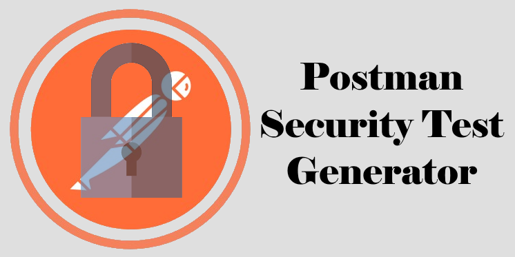
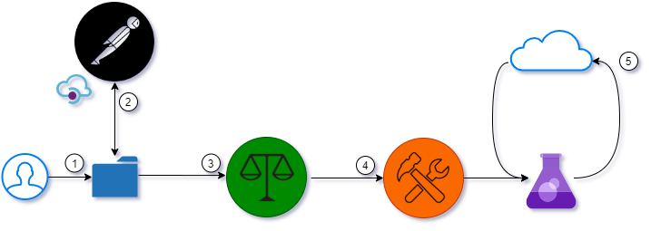

# Postman Security Test Generator
For role based applications, security tests can be a burden to create and maintain. Each endpoint must be tested for every role in the system to ensure you are not allowing unsecured access. The postman security test generator will look at your OpenAPI spec, generate, and execute an exhaustive test to validate your endpoints are locked down like they should be.

## Setup
In this repo there are two files you need to import into your [Postman](https://postman.com/) workspace:
* Security Test Generator *collection*
* Security Test *Environment*

These two files will add the necessary components to get your workspace up and running with automatic security tests


## Use Case
V1 of the security test generator puts a focus on **role based applications** that use a special header in every request to let the api know which role the user is operating as.

This pattern may be adapted to other use cases in the future, but to illustrate the premise, a manual header was necessary.


## How It Works


1. The collection is started either manually or by an automated process
2. The Postman Pro API is queried to get the following:
    1. All the user-defined APIs for a given workspace
    2. Current version and schema for a single, user-defined API
3. A series of governance tests are run against the OAS spec including:
    1. Min/max number of APIs allowed per workspace
    2. Parameters start with a lower case letter, schemas/responses start with an upper case letter
    3. If enabled, verify all parameters/schemas/responses have a description. Also verifies description length
    4. If enabled, verify all parameters/schemas/responses have an example. *This is required for the security tests to function properly*
4. All endpoints defined in the OAS spec are compiled and added to a **security paths array** for testing
    1. Any path variables are replaced with the **example** for the parameter
    2. Each endpoint will have 4 mutations
        * Without a trailing slash
        * With a trailing slash
        * OPTIONS method with a trailing slash
        * OPTIONS method without a trailing slash
    3. A user-defined security extension in the OAS is used to identify allowed roles for each endpoint
5. The **security paths array** is iterated over, doing the following for each security path:
    1. Setting the request method and url
    2. Configuring the user-defined *role* header with the current *role* being tested
    3. Executing the request
    4. Comparing the status code to the `allowed roles` extension values defined in the OAS
        * If the role being tested is allowed, it verifies the response code **is not** 401
        * If the role being tested is not allowed, it verifies the response code **is** 401

If there are multiple APIs in the provided workspace, steps 2-5 are run automatically for each one.

## Assumptions
A few assumptions are made about the structure of your API when executing this collection:
* The API is written in OAS3.0, either in JSON or YAML
* The API is defined in Postman
* Your API uses a header to specify a specific `role`
* Each endpoint in your OAS definition has an extension with the allowed `roles`

## Role Based API
To properly use this collection, the assumption is made that you have defined roles and you pass in a role to each of your requests. Why?

Part of a role based application is explicitly granting or denying access to users given a role they currently have. This allows for enhanced security, cleaner code, and a well defined structure of permissions and actions.

### Example
Let's take an example of some defined roles for a **forum**. Forums have users, moderators, admins, and of course: banned users. For the security test generator, these roles could be simply defined in an array like this:
```javascript
[
  'user',
  'mod',
  'admin',
  'banned'
]
```

In our OAS spec, we might define the new post endpoint like so:
```yaml
/posts:
  post:
    description: Add a new post to the forum
    requestBody:
      required: true
      content:
        application/json:
          schema:
            $ref: '#/components/schemas/Post'
    responses:
      201:
        $ref: '#/components/responses/Created'
      400:
        $ref: '#/components/responses/BadRequest'
    x-allowed-roles:
      - user
      - mod
      - admin
```

When the security test generator runs, it will hit the `/posts` endpoint 4 times, one for each of our four roles. With the `x-allowed-roles` extension, the tests will know to expect a status code other than `401` for *user, mod,* and *admin*, and expect a `401` for a user with a *banned* role.

## Environment Variables
Execution of the generator is driven by the variables below:

|Env Variable Name|Description|Type|
|-----------------|-----------|:--:|
|**env-apiKey**|Postman pro API key used to query Postman. [Generate one here](https://learning.postman.com/docs/developer/intro-api/)|string|
|**env-minApiCount**|Governance property setting the minimum amount of APIs allowed in a workspace|number|
|**env-maxApiCount**|Governance property setting the maximum amount of APIs allowed in a workspace|number|
|**env-workspaceId**|Specifies which Postman workspace to query|string|
|**env-requireParamDescription**|Governance property determining if parameter/schema/response descriptions are required|boolean|
|**env-requireParamExample**|Governance property determining if parameter/schema/response examples are required. **Must be set to true for security tests to work!**|boolean|
|**env-paramDescriptionMinLength**|Governance property setting the minimum length of a description. *Only needed if requireParamDescription is true*|number|
|**env-paramDescriptionMaxLength**|Governance property setting the maximum length of a description. *Only needed if requireParamDescription is true*|number|
|**env-roles**|User defined roles to test with for the security tests. Each endpoint will be hit with every role.|array of strings|
|**env-securityExtensionName**|Name of extension in OAS file that dictates allowed roles at a given endpoint|string|
|**env-roleHeaderName**|Name of the header used to pass in the role of the user|string|
|**env-server**|Name in the `description` property of the servers section in OAS. Used to get the base url|string|
|**env-jsonToYaml**|Hardcoded npm package used to translate yaml to json. Not needed if your OAS is already json||

## Collection
The collection itself does not need to be altered before use. Everything is driven off the environment variables. You can simply [import](https://learning.postman.com/docs/getting-started/importing-and-exporting-data/) the collection and environment, configure the environment variables, and run it.

## Updates and New Features
If you wish to contribute to the generator, please feel free! Make your update and submit a pull request! My hope is to lay down the foundation for some outstanding automated tests and governance around APIs.

If you don't wish to contribute, but have ideas, submit an issue and I'll see if I can get it in to share with others.

## Contact
You may contact me by any of the social media channels below. I love to talk, so feel free to say hey!

[![Twitter][1.1]][1] [![GitHub][2.1]][2] [![LinkedIn][3.1]][3] [![Ready, Set, Cloud!][4.1]][4]

[1.1]: http://i.imgur.com/tXSoThF.png
[2.1]: http://i.imgur.com/0o48UoR.png
[3.1]: http://i.imgur.com/lGwB1Hk.png
[4.1]: https://readysetcloud.s3.amazonaws.com/logo.png

[1]: http://www.twitter.com/allenheltondev
[2]: http://www.github.com/allenheltondev
[3]: https://www.linkedin.com/in/allen-helton-85aa9650/
[4]: https://readysetcloud.io
